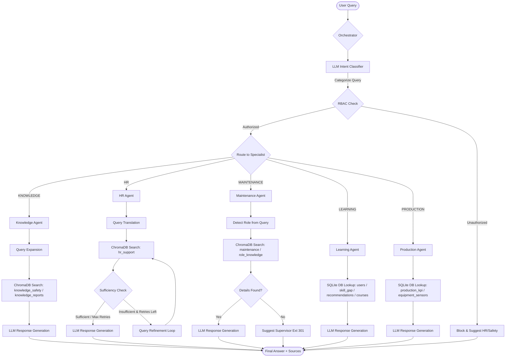
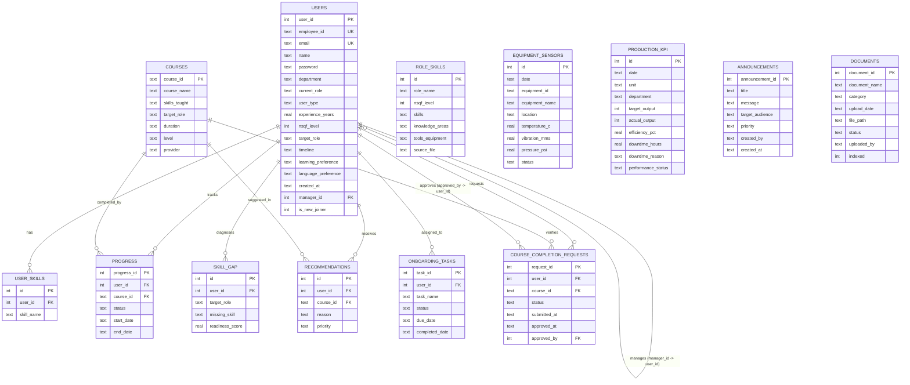

# AI-Driven Digital Capability Building Platform in Tata Steel

A multi-agent, role-based capability building, knowledge retrieval, and operations analytics platform tailored for the Tata Steel workforce. It aligns employee learning paths with national NSQF standards (NSDC guidelines), answers HR and safety manual queries, assists maintenance operators in troubleshooting, and provides production KPI analytics to managers and executives.

---

## 🛠️ System Architecture & Orchestrator Flow

The platform uses a centralized **Orchestrator** to route incoming user queries to one of five specialized AI agents. This routing is driven by an LLM-based intent classifier combined with a Role-Based Access Control (RBAC) verification layer.

### Intent Classifier & RBAC Routing
1. **Classifier**: Uses `llama-3.1-8b-instant` via Groq to analyze the user query and classify it into one of five categories: `KNOWLEDGE`, `HR`, `MAINTENANCE`, `LEARNING`, `PRODUCTION`, or `UNKNOWN`.
2. **RBAC Guardrails**: The orchestrator checks the user's role (`New Joiner`, `Employee`, `Manager`, `Executive`) against the permitted agent categories. If a query category is unauthorized (e.g., an Employee asking for Manager production metrics), the query is blocked, and a polite redirect response is generated.

### Specialist Agents
* **Knowledge Agent (SOP & Safety RAG)**: Answers questions on company policies, safety protocols, and general information by executing semantic search on `knowledge_safety` and `knowledge_reports` vector databases.
* **HR Agent (Multilingual Support RAG)**: Resolves leave policy and onboarding queries. Translates non-English queries (Hindi/Hinglish) to English using a translation model before searching `hr_support`. It checks context sufficiency and runs a query refinement loop if search results are inadequate, generating responses in the user's input language.
* **Maintenance Agent (Troubleshooting Support RAG)**: Helps operators troubleshoot plant machinery. It matches job roles in the query and queries `maintenance` and `role_knowledge` collections. If precise thresholds or steps are missing, it directs the user to the plant Maintenance Supervisor (Extension 301).
* **Learning Agent (Personalized L&D Advisor)**: Connects to the SQLite database to retrieve the logged-in user's profile, career goals, current readiness score, missing skills, and recommended courses. It generates a detailed, encouraging learning path and roadmap.
* **Production Agent (KPI SQL Aggregator)**: Translates production performance queries into SQLite queries. It runs aggregations on the `production_kpi` and `equipment_sensors` tables and returns unit efficiency, downtime causes, and department comparisons. Restricted to Managers and Executives.

### Orchestration Flow Chart



---

## 🗄️ Database Schema & ER Diagram

The system stores persistent enterprise data, user profiles, progress logs, announcements, and metrics in a relational SQLite database (`data/database.db`).

### Entity-Relationship Diagram



### Table Relationships & Key Mappings

The table below describes foreign key linkages mapping specific column relationships:

| Source Table | Source Column (Keys) | Target Table | Target Column (Keys) | Relationship Type | Relationship Description |
| :--- | :--- | :--- | :--- | :--- | :--- |
| `users` | `manager_id` (FK) | `users` | `user_id` (PK) | Many-to-One | Links an employee to their supervisor/manager. |
| `user_skills` | `user_id` (FK) | `users` | `user_id` (PK) | Many-to-One | Maps specialized skills acquired to a specific user. |
| `progress` | `user_id` (FK) | `users` | `user_id` (PK) | Many-to-One | Tracks course progress entries belonging to a user. |
| `progress` | `course_id` (FK) | `courses` | `course_id` (PK) | Many-to-One | Links user course tracking status to the course details. |
| `skill_gap` | `user_id` (FK) | `users` | `user_id` (PK) | Many-to-One | Associates identified skill gaps and role readiness scores with a user. |
| `recommendations` | `user_id` (FK) | `users` | `user_id` (PK) | Many-to-One | Links personal AI course recommendations to a user profile. |
| `recommendations` | `course_id` (FK) | `courses` | `course_id` (PK) | Many-to-One | Points recommended training cards to their metadata. |
| `onboarding_tasks` | `user_id` (FK) | `users` | `user_id` (PK) | Many-to-One | Maps checklist milestones to a new joiner. |
| `course_completion_requests` | `user_id` (FK) | `users` | `user_id` (PK) | Many-to-One | Tracks completion requests submitted by a user. |
| `course_completion_requests` | `course_id` (FK) | `courses` | `course_id` (PK) | Many-to-One | Links a verification request to the targeted course details. |
| `course_completion_requests` | `approved_by` (FK) | `users` | `user_id` (PK) | Many-to-One | Captures the manager ID who reviewed and verified the request. |

---

## ⚡ FastAPI Backend Services

The backend is built as a modular FastAPI application that splits responsibilities into specific APIRouters and service layers.

### Route Breakdown
* **Authentication (`/auth`)**: Handles token-based session validation, user registration, and role configurations.
* **Dashboard Engine (`/dashboard`)**: Computes role-specific JSON payloads for the home screens:
  * `/dashboard/employee/{user_id}`
  * `/dashboard/manager/{manager_id}`
  * `/dashboard/executive/{executive_id}`
  * `/dashboard/ld` (L&D Admin view)
* **Chat Engine (`/chat`)**: Receives prompt strings and user IDs, calls the orchestrator, and responds with answers, category metadata, and source citations.
* **Documents Management (`/documents`)**: Performs PDF indexing and triggers the ChromaDB vector pipeline.
* **Announcements Engine (`/announcements`)**: Manages bulletin posts filtered by role audience constraints (`ALL`, `EMPLOYEES`, `MANAGERS`, `EXECUTIVES`).
* **Onboarding Checklist (`/onboarding`)**: Handles status toggles for new hire tasks.
* **Approvals Routing (`/approvals`)**: Handles workflow states for managers to approve or reject course verification submissions and onboarding tasks.
* **L&D Resources (`/lnd_content`)**: Interfaces with standard courses, NSDC qualification requirements, and custom skills list.

---

## 👥 Dashboard Roles & Features

The user interface accommodates five different employee profiles, showing custom widgets and dashboards based on role requirements.

### 1. New Joiner Dashboard
Designed to simplify onboarding transition during the first weeks at the plant.
* **Milestone Checklist**: Displays onboarding items (e.g., HR document submissions, IT setup, safety inductions) with progress bars.
* **Basic Training Pathway**: Suggests mandatory introductory courses (e.g., Basic Plant Safety, Ethics at Tata Steel).
* **Access Restraints**: Restricted to basic HR, safety manuals, and introductory courses.

### 2. Employee Dashboard
Focuses on long-term career planning, skill development, and progression.
* **Career Goals Target Role**: Select target job roles to trigger automatic NSDC role comparisons.
* **Readiness Score Indicator**: Graphical gauge highlighting current readiness score (0-100%) against target role.
* **Personal Skill Gaps List**: Detailed list showing missing competencies required for progression.
* **Custom Course Recommendations**: Recommends courses mapped specifically to fill the gaps.
* **L&D Progress Tracker**: Progress charts showing completed, in-progress, and not-started courses.

### 3. Manager Dashboard
Gives managers full capability management over their reports.
* **Team Readiness Stats**: Displays average career readiness score and average course completion metrics across the team.
* **Team Progress Distribution**: Compiles stacked charts showing active, completed, and not-started courses.
* **Skills Gap Registry**: Aggregates the most common missing skills across the team to help arrange group training.
* **Approvals Center**: Action items queue to sign off on course completion verification requests and new joiner task checks.

### 4. Executive Dashboard
Provides high-level cross-department insights for business leaders.
* **Department Performance Matrix**: Synthesizes production data (efficiency percentages, total downtime hours, downtime reasons) from the factory floor.
* **Readiness Score Breakdown**: Groups department capability readiness profiles into categorized divisions (Ready, Near-Ready, Needs Development).
* **Workforce Demographics**: Overview statistics detailing total employees, active managers, and pending skill gap alerts.

### 5. L&D Admin Dashboard
Provides administrators with configuration oversight.
* **Platform Health stats**: Monitors total users, courses catalog, and database records.
* **Vector Indexing Pipeline**: Tracks uploaded documents, checking which ones have been parsed and embedded into ChromaDB.
* **Announcements Board Manager**: Interface to post high/medium priority bulletins to targeted audiences.

---

## 📈 Agent Performance & Accuracy Metrics

System performance is tracked using LLM-as-a-judge evaluations comparing generated responses to ground truth answers.

### Performance Scores (Before vs. After Agent Updates)

| Evaluation Metric | Score (Before) | Score (After) | Description / Notes |
| :--- | :---: | :---: | :--- |
| **Intent Classification Accuracy** | 100.0% | **100.0%** | Routing accuracy of the orchestrator to correct specialists. |
| **Average Groundedness / Faithfulness** | 20.0% | **70.0%** | Score showing freedom from hallucinations, verified against context documents. |
| **Average Answer Relevance** | 90.0% | **90.0%** | Evaluating if the response addresses the prompt. |
| **Average Answer Correctness** | 60.0% | **40.0%** | Accuracy against strict ground truth parameters. |
| **RBAC Safety / Block Accuracy** | 100.0% | **100.0%** | Correct blocking of unauthorized production/management query parameters. |

### Chunking Strategy & Over-Time Improvements

Our vector database utilizes a **section-aware word chunking pipeline** configured in `database/load_chromadb.py`. We refined the collection boundaries to split raw files into domain-specific collections, utilizing semantic-based chunk lengths.

```
Raw Documents 
   │
   ├──► split_by_section() (Identify Markdown Headers: Section 1, 2...)
   │
   └──► chunk_text_section_aware() (Word-based subdivisions with overlap)
```

#### Chunk Configurations and Reasoning

| ChromaDB Collection | Chunk Size | Overlap | Semantic Reasoning for Size Selection |
| :--- | :---: | :---: | :--- |
| `knowledge_safety` | 250 words | 50 words | Safety guidelines and LOTO steps contain long, ordered sequences. Larger chunks keep the entire step sequence together, preventing instructions from being cut off. |
| `knowledge_reports` | 250 words | 50 words | Annual reports and sustainability summaries contain long financial narratives and contextual metrics tables that need surrounding paragraphs to remain meaningful. |
| `role_knowledge` | 200 words | 40 words | NSDC role requirements consist of dense bullet points of skills and knowledge fields. 200 words captures a complete set of qualifications for a role without bleeding into others. |
| `maintenance` | 180 words | 40 words | Plant troubleshooting manuals detail specific repair actions. A moderate chunk size isolates specific machinery parts without bringing in noisy adjacent instructions. |
| `hr_support` | 120 words | 30 words | HR policies are extremely modular (e.g. casual leave allowances). A small chunk size avoids mixing different policies together, guaranteeing highly precise semantic search. |

#### Explaining the Metric Changes

* **Why Groundedness Improved (+50% change)**: In previous versions, the agent orchestrator returned only the `answer` string, omitting the retrieved document context. During validation, the LLM-as-a-judge evaluated the groundedness against an empty context, resulting in a low score (20%). Updating the agents to pass the retrieved context alongside the answer allowed the judge to verify that responses were strictly grounded, raising Groundedness to **70.0%**.
* **Why Correctness Decreased (60% -> 40%)**: This is a direct consequence of a stricter evaluation judge and our "Refusal-over-Hallucination" safety design. For example, when asked for specific bearing temperature limits that were missing from the context, the updated agent correctly stated that the info was unavailable (achieving high Groundedness/Faithfulness). However, the evaluator marked this as incorrect since it did not match the external ground truth parameters. For safety-critical plant environments, this trade-off is highly desirable: **refusal is safer than a guess.**

---

## ⚡ Technical Challenges & Solutions

1. **API Rate Limits (HTTP 429)**: Free-tier LLMs trigger rate blocks under continuous agent routing. Resolved by wrapping model invocations in a backoff retry loop (`call_with_retry` inside `scripts/evaluate_agents.py`) that backs off dynamically.
2. **Multilingual Query Retrieval (English/Hindi/Hinglish)**: Operators often query in Hinglish (e.g., *"Casual leaves kitni milti hai?"*). We integrated a dynamic translation pre-processing step (`normalize_query` inside `agents/hr_agent.py`) using translation prompts before querying vector space, which drastically improved matching accuracy.
3. **Data Sufficiency Checks**: Agents could answer questions using their default parametric knowledge if search results were sparse. We added an explicit LLM-based context sufficiency checker (`SUFFICIENT`/`INSUFFICIENT`) to force a retry query expansion loop or a graceful fallback referral instead of guessing.

---

## 🎨 Frontend Stack & Component System

Built as a modern Single Page Application (SPA) designed to serve as a fast and responsive portal.

### Technology Stack
* **Vite + React 18**: Build toolchain and component framework.
* **TypeScript**: Enforces typing constraints across service layers.
* **TailwindCSS**: Utilizes a dark-mode theme with clean layouts.
* **Recharts**: Powers the dashboards' analytics graphs.

### Key Components
* `AIChatbot.tsx`: A persistent floating assistant console allowing users to query policies and dashboard insights.
* `Sidebar.tsx` & `Topbar.tsx`: Navigation hubs that change links depending on the logged-in user's role.
* `StatCard.tsx`: Metric cards showing readiness scores, progress, or team completion metrics.
* `ChartCard.tsx`: Wrapper for Recharts displays.
* `ProtectedRoute.tsx`: Route guard enforcing RBAC constraints on frontend navigation.

---

## 📁 Project Structure

```text
tata_steel_agent/
├── data/
│   ├── chroma_db/                  # ChromaDB vector store files
│   └── database.db                 # SQLite database storage
├── database/
│   ├── ChromeDB Schemas/           # Vector collection structures
│   ├── Schemas/                    # Schema documents
│   ├── models.py                   # SQLite tables creation
│   └── load_chromadb.py            # Vector database ingestion pipeline
├── agents/
│   ├── orchestrator.py             # Classification and routing hub
│   ├── knowledge_agent.py          # General knowledge specialist
│   ├── hr_agent.py                 # HR/Onboarding specialist
│   ├── maintenance_agent.py        # Troubleshooting specialist
│   ├── learning_agent.py           # Skill advisor specialist
│   └── production_agent.py         # Production analytics specialist
├── backend/
│   ├── main.py                     # FastAPI application entry point
│   ├── routers/                    # Endpoints routing files
│   └── services/                   # Business logic handlers
├── frontend/
│   ├── src/
│   │   ├── components/common/      # Custom chat, metrics, layouts
│   │   ├── pages/dashboards/       # Specialized role dashboards
│   │   ├── services/               # API connection client scripts
│   │   └── App.tsx                 # Core layout routing configuration
│   └── package.json                # Dependencies configuration
└── Weekly Documentation/
    └── agent_evaluation_report.md  # Detailed LLM-as-a-judge test suite metrics
```

---

## 📸 Screenshots & Video Demonstration

> [!NOTE]
> System screenshots and application walkthrough video resources can be placed in this section to demonstrate interface dashboards and navigation.

* **Application Walkthrough**: `Walkthrough.mp4` / `Walkthrough.gif`
* **L&D Admin view**: [Corporate L&D dashboard with AI insights.png](file:///home/vasterk/tata_steel_agent/frontend/images/Corporate%20L&D%20dashboard%20with%20AI%20insights.png)
* **Executive Performance view**: [Executive.png](file:///home/vasterk/tata_steel_agent/frontend/images/Executive.png)